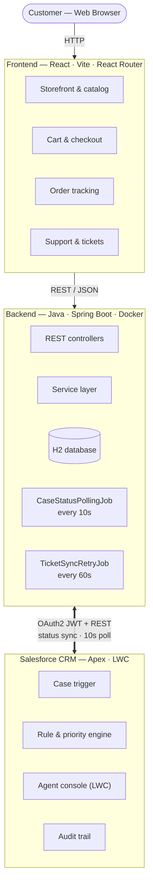

# Cartiva — E-commerce Order & Customer Service Platform

Three-tier POC: a React storefront → Spring Boot backend → Salesforce/Apex CRM. A customer
buys something, reports a problem, an Apex rule engine triages the resulting Case, a support
agent resolves it in Salesforce, and the resolution flows back to the customer.



Full component/data-flow breakdown (endpoints, scheduled-job config keys, exact class names,
file:line source references) — open [`docs/cartiva-system-architecture.html`](docs/cartiva-system-architecture.html)
in a browser.

```
force-app/    Salesforce DX project (Apex, LWC, custom objects/fields, metadata)
backend/      Spring Boot REST API + Salesforce integration (Dockerized)
frontend/     React storefront (Vite)
scripts/      Anonymous Apex data-seeding scripts
run-local.sh  Starts backend (Docker) + frontend (npm dev) together
stop-local.sh Stops the backend (Docker)
```

---

## Prerequisites

Install these before you start:

| Tool | Check | Get it |
|---|---|---|
| Docker Desktop | `docker --version` | https://www.docker.com/products/docker-desktop |
| Node.js 18+ | `node --version` | https://nodejs.org |
| Salesforce CLI (`sf`) | `sf --version` | https://developer.salesforce.com/tools/salesforcecli |
| A Salesforce org | — | A free [Developer Edition](https://developer.salesforce.com/signup) org works fine |
| `openssl` | `openssl version` | Preinstalled on macOS/Linux |

---

## 1. Clone and connect the Salesforce CLI to your org

```bash
git clone <this-repo>
cd Cartiva-Ecom

# Opens a browser window to log in — pick any alias you like.
# The rest of this README uses "case-triage-poc" as the alias; swap in yours.
sf org login web -a case-triage-poc
```

Open the org in a browser any time with:

```bash
sf org open -o case-triage-poc
```

---

## 2. Deploy Salesforce metadata

```bash
sf project deploy start -o case-triage-poc
sf org assign permset -n Case_Triage_User -o case-triage-poc
sf apex run --file scripts/apex/seedTriageRules.apex -o case-triage-poc
```

Optional — run the Apex test suite:

```bash
sf apex run test -o case-triage-poc -c -r human
```

This deploys the `Case` object's custom fields, the `Case_Triage_Rule__c` / `Case_Triage_Decision__c`
objects, the Apex triage engine, and the `caseTriageDetail` / `caseTriageDashboard` Lightning
components.

### One-time, in-browser step (not scriptable)

Add the components to their pages via **Lightning App Builder**:

1. `sf org open -o case-triage-poc`
2. Go to any **Case** record → gear icon (top right) → **Edit Page** → drag **`caseTriageDetail`**
   onto the page → **Save** → **Activate** (as org default, or for your app).
3. Go to **App Launcher** → your app's Home page → **Edit Page** → drag **`caseTriageDashboard`**
   onto the page → **Save** → **Activate**.

---

## 3. Connect the backend to Salesforce (JWT Bearer flow)

The backend authenticates to Salesforce as a server — no interactive login, no password. This
uses the **JWT Bearer flow** via an **External Client App**, which works even when
"Allow OAuth Username-Password Flows" is disabled (the default on newer orgs) and isn't affected
by MFA.

### 3.1 Generate a certificate/key pair

```bash
mkdir -p backend/certs
openssl req -x509 -sha256 -nodes -days 3650 -newkey rsa:2048 \
  -keyout backend/certs/server.key -out backend/certs/server.crt \
  -subj "/CN=ShopAssist Backend/O=ShopAssist POC"
```

- `backend/certs/server.key` — private key. **Never commit this** (already gitignored). Only the
  backend container reads it.
- `backend/certs/server.crt` — public certificate. This is what you upload to Salesforce in the
  next step.

### 3.2 Create the External Client App in Salesforce

`sf org open -o case-triage-poc`, then:

1. **Setup → App Manager → External Client Apps → External Client App Manager → New External
   Client App**.
2. Basic Information: give it a name (e.g. `ShopAssist Backend`), fill in a contact email.
3. Under **OAuth Settings**:
   - **Callback URL**: any placeholder works, e.g. `https://login.salesforce.com/services/oauth2/callback`
     (the JWT flow doesn't use it, but the field is required).
   - **OAuth Scopes**: add *Manage user data via APIs (api)* and *Perform requests at any time
     (refresh_token, offline_access)*.
   - **Flow Enablement** → check **Enable JWT Bearer Flow** → **Certificate Upload** → upload
     `backend/certs/server.crt`.
4. Save. Then open the app you just created → **Policies** tab → **Edit**:
   - **Permitted Users**: *Admin approved users are pre-authorized*.
   - **Selected Profiles**: add your own profile (e.g. `System Administrator`).
5. Still on the app page → **Settings** tab → **Consumer Key and Secret** → click it (may prompt
   for a verification code) → copy the **Consumer Key**. This is `SALESFORCE_CLIENT_ID`.

### 3.3 Fill in `backend/.env`

`run-local.sh` creates this file for you from `backend/.env.example` on first run — just edit the
values:

```
SALESFORCE_LOGIN_URL=https://login.salesforce.com
SALESFORCE_CLIENT_ID=<Consumer Key from step 3.2>
SALESFORCE_USERNAME=<your Salesforce username, e.g. you@org.com>
SALESFORCE_JWT_PRIVATE_KEY_PATH=/app/certs/server.key
SALESFORCE_POLLING_ENABLED=true
```

No password or security token needed — the signed JWT *is* the credential.

> Skipping Salesforce setup? The backend still runs fully without it — tickets are created
> locally and stay `SYNC_PENDING` (auto-retried once you add credentials). Check
> `curl localhost:8080/api/salesforce/status` any time for `{"configured": bool, "connected": bool}`.

---

## 4. Run everything

```bash
./run-local.sh
```

This single script:
- Creates `backend/.env` from the example file if it doesn't exist yet.
- Builds and starts the backend in Docker (`localhost:8080`).
- Prints whether the Salesforce connection is live.
- Installs frontend dependencies and starts the Vite dev server (`localhost:5173`, proxies
  `/api` to the backend — no CORS config needed).

| Service | URL |
|---|---|
| Frontend | http://localhost:5173 |
| Backend API | http://localhost:8080 |
| H2 console | http://localhost:8080/h2-console (JDBC URL: `jdbc:h2:file:/app/data/cartiva`) |
| Salesforce org | `sf org open -o case-triage-poc` |

Stop everything:

```bash
./stop-local.sh
```

Stops the backend (Docker). If the frontend dev server is still running in your terminal
(started by `run-local.sh`), stop it with `Ctrl+C` there.

---

## Try the end-to-end flow

1. Frontend: browse to *Running Shoes Pro* → Add to Cart → Checkout → Place Order.
2. My Orders → open the order → *Report an Issue* → pick "Delivery Issue" → describe
   "My package has not arrived."
3. Ticket is created locally and (if Salesforce credentials are set) as a Case in your org,
   auto-triaged to Category=Delivery, Priority=Medium, Team=Logistics, SLA=24h.
4. In Salesforce, open the Case, use the `caseTriageDetail` component to change Fulfillment
   Status and enter a Resolution, then Resolve.
5. Within 10s the backend's polling job picks up the change; the ticket's status page
   (auto-refreshing every 10s) shows the resolution.

---

## Reference

### Backend APIs

```
GET/POST /api/products, /api/products/{id}
POST     /api/orders            GET /api/orders/{id}
POST     /api/tickets           GET /api/tickets/{id}
GET      /api/customers/{id}, /api/customers/{id}/orders, /api/customers/{id}/tickets
GET      /api/salesforce/status
GET      /api/salesforce/cases/{id}   POST /api/salesforce/cases/retry
```

### Salesforce data model

- `Case` gets 13 custom fields: triage result fields (`Triage_Category__c`, `Triage_Priority__c`,
  `Recommended_Team__c`, `SLA_Hours__c`, `SLA_Due_Date__c`, `Triage_Reason__c`,
  `Triage_Status__c`, `Triage_Override__c`) plus e-commerce fields (`External_Ticket_Id__c`,
  `External_Order_Id__c`, `Order_Amount__c`, `Resolution__c`, `Fulfillment_Status__c`).
- `Case_Triage_Decision__c` — audit trail of every triage/override decision.
- `Case_Triage_Rule__c` — 30 keyword → category/priority/team/SLA rules.

### Apex

`CaseTrigger` → `CaseTriggerHandler` → `CaseTriageService`, backed by `CaseCategoryService`,
`CasePriorityService`, `CaseAssignmentService`, `CaseSLAService`. Bulk-safe (no SOQL/DML in
loops), per-record error isolation. `CaseTriageOverrideController` (manual override) and
`CaseResolutionController` (fulfillment status + resolution) are the two mutation entry points,
both CRUD/FLS-checked. 19 Apex tests cover every scenario in the requirement doc's Apex Testing
section.

Categories: Delivery, Product Issue, Payment, Return, Refund, Cancellation, General.
Teams: Logistics, Product Support, Payments, Returns, Finance, Order Management, General Support.

### Backend

Packages: `model` (JPA entities) / `repository` / `service` / `controller` / `salesforce`
(OAuth client, Case CRUD, field mapping) / `dto` / `config` / `sync` (polling + retry jobs). H2
file-based DB (`backend/data/`), seeded on first boot with sample products, a sample customer
("Peter Baines"), and sample order/ticket history.

### Frontend

Vite + React Router, plain CSS, `fetch`-based API client, React Context for cart state. No
login — a single seeded account (id `1`, editable via the Profile page) is used for all
customer-scoped calls (`frontend/src/constants.js`).

Pages: Home, Product Listing, Product Detail, Cart, Checkout, Order Confirmation, My Orders,
Order Detail, Create Ticket, Ticket Detail, My Support, Profile.

### Architecture diagram

See `docs/architecture-diagram.html` (open directly in a browser) for a visual component/data-flow
overview, including endpoints, scheduled job intervals, and the Salesforce sync direction.
