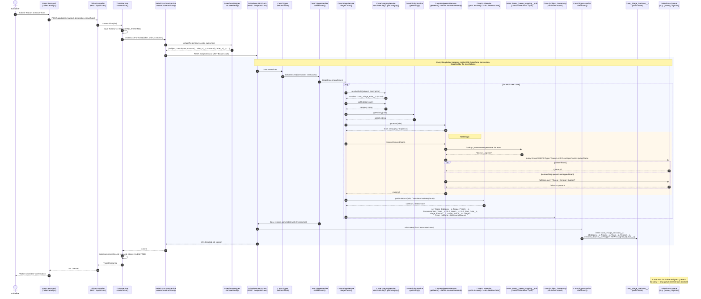
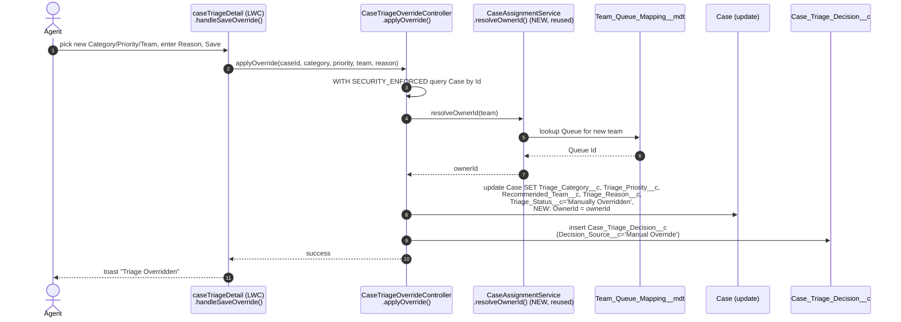

# Ticket Assignment Flow (proposed)

Automatic Case ownership assignment (Queue routing) at ticket-log time, layered onto the
existing triage pipeline. **Not yet implemented** — this documents the proposed flow and the
exact classes/methods it touches, for review before building it.

Today `CaseAssignmentService.getTeam()` only returns a team *label* (`Recommended_Team__c`
picklist value) — no `Case.OwnerId` is ever set, and no Queue/Group metadata exists in the org.
This flow adds real ownership assignment on top of that, without changing the existing
category/priority/SLA logic.

## End-to-end sequence

## Manual override reassignment (secondary flow)

Today `CaseTriageOverrideController.applyOverride()` lets an agent change
`Recommended_Team__c` but never touches `OwnerId` — after this change the Case's actual owner
would desync from the displayed team unless override also reassigns.

## Impacted files

### Core assignment logic (required)

| File | Change |
|---|---|
| `force-app/main/default/classes/CaseAssignmentService.cls` | Add `resolveOwnerId(String team)` — queries the Queue mapped to `team`, falls back to a default queue. Existing `getTeam()` unchanged. |
| `force-app/main/default/classes/CaseTriageService.cls` | Call `CaseAssignmentService.resolveOwnerId()` and set `case.OwnerId` alongside the existing field writes, pre-insert. |
| `force-app/main/default/classes/CaseTriggerHandler.cls` | `afterInsert` audit-record builder: include assigned queue on the `Case_Triage_Decision__c` row. |
| `force-app/main/default/classes/CaseTriageOverrideController.cls` | `applyOverride()` — reassign `OwnerId` when `team` changes, so manual overrides don't desync ownership from the triage decision. |

### New metadata (required)

| File | Purpose |
|---|---|
| `force-app/main/default/queues/Queue_Logistics.queue-meta.xml` (×7, one per team) | Case queues — don't exist yet anywhere in the org. |
| `force-app/main/default/objects/Team_Queue_Mapping__mdt/*` | **New** Custom Metadata Type mapping `Team__c` picklist values → Queue `DeveloperName`, so the Apex lookup isn't a hardcoded switch statement. |
| `force-app/main/default/objects/Case_Triage_Decision__c/fields/Assigned_Queue__c.field-meta.xml` | New audit field capturing which queue got the Case. |
| `force-app/main/default/permissionsets/Case_Triage_User.permissionset-meta.xml` | Add `OwnerId` field permission + queue membership/visibility (currently has neither). |

### Tests (required)

| File | Change |
|---|---|
| `force-app/main/default/classes/CaseAssignmentServiceTest.cls` | **New** — doesn't exist today; needs full coverage for `resolveOwnerId()` incl. fallback path. |
| `force-app/main/default/classes/CaseTriageServiceTest.cls` | Add `OwnerId` assertions to existing scenarios (Delivery, Payment/High, Return, Refund, bulk, override). |
| `force-app/main/default/classes/CaseTriggerHandlerTest.cls` | Assert audit record captures `Assigned_Queue__c`. |
| `force-app/main/default/classes/CaseTriageControllerTest.cls` | Assert override reassigns `OwnerId`. |

### Optional — surfacing in UI

| File | Change |
|---|---|
| `force-app/main/default/lwc/caseTriageDetail/{.js,.html}` | Show assigned queue/owner name. |
| `force-app/main/default/lwc/caseTriageDashboard/*` | Break down stats by queue. |
| `backend/.../model/Ticket.java`, `dto/TicketResponse.java`, `salesforce/SalesforceMapper.java` | Pull owner/queue name back onto the local Ticket if it should show on the customer-facing status page. |
| `frontend/src/pages/TicketDetail.jsx` | Display assigned team/queue to the customer. |
